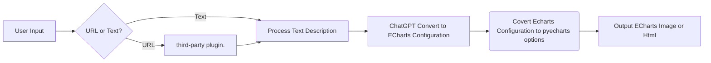

# 📊 Charts-Generator-ChatGPT-Plugin

This plugin uses OpenAI's ChatGPT to turn text or URL content into ECharts visualizations. 🚀🤖

## Description

The Charts-Generator-ChatGPT-Plugin leverages the capabilities of OpenAI's ChatGPT to interpret and analyze user input or web content, and generate corresponding statistical charts using ECharts. It takes a text description or a URL as input, summarizes the content, creates a description that conforms to a statistical chart, and finally converts the description into a chart configuration form that can be implemented by the ECharts library.

Here's a flowchart that illustrates the process:



_third-party plugin: `LinkReader` or `WebPilot`_

## Quickstart

### Setup

To install the required packages for this plugin, run the following command:

```bash
pip install -r requirements.txt
```

To run the plugin, enter the following command:

```bash
python main.py
```


Once the local server is running:

Navigate to https://chat.openai.com.
In the Model drop down, select "Plugins".
Select "Plugin store".
Select "Develop your own plugin".
Enter in localhost:5003 since this is the URL the server is running on locally, then select "Find manifest file".
The plugin should now be installed and enabled!

## Getting help

If you run into issues or have questions building a plugin, please join our Developer community forum.
